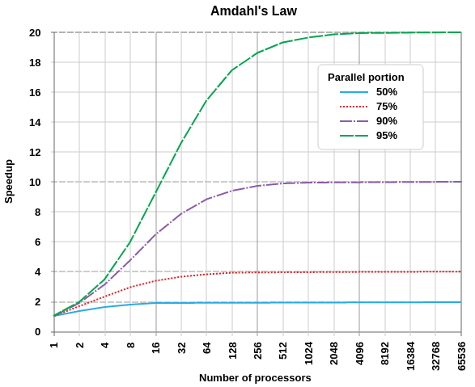
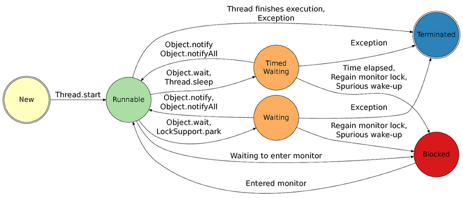
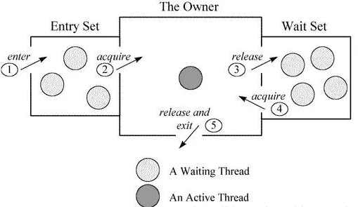

# Теория многопоточности

* [Введение в многопоточность](#%D0%B2%D0%B2%D0%B5%D0%B4%D0%B5%D0%BD%D0%B8%D0%B5-%D0%B2-%D0%BC%D0%BD%D0%BE%D0%B3%D0%BE%D0%BF%D0%BE%D1%82%D0%BE%D1%87%D0%BD%D0%BE%D1%81%D1%82%D1%8C)
* [Терминология: многопоточность, конкурентность, параллельность](#%D1%82%D0%B5%D1%80%D0%BC%D0%B8%D0%BD%D0%BE%D0%BB%D0%BE%D0%B3%D0%B8%D1%8F-%D0%BC%D0%BD%D0%BE%D0%B3%D0%BE%D0%BF%D0%BE%D1%82%D0%BE%D1%87%D0%BD%D0%BE%D1%81%D1%82%D1%8C-%D0%BA%D0%BE%D0%BD%D0%BA%D1%83%D1%80%D0%B5%D0%BD%D1%82%D0%BD%D0%BE%D1%81%D1%82%D1%8C-%D0%BF%D0%B0%D1%80%D0%B0%D0%BB%D0%BB%D0%B5%D0%BB%D1%8C%D0%BD%D0%BE%D1%81%D1%82%D1%8C)
* [Задача масштабирования](#%D0%B7%D0%B0%D0%B4%D0%B0%D1%87%D0%B0-%D0%BC%D0%B0%D1%81%D1%88%D1%82%D0%B0%D0%B1%D0%B8%D1%80%D0%BE%D0%B2%D0%B0%D0%BD%D0%B8%D1%8F)
    * [Закон Амдала](#%D0%B7%D0%B0%D0%BA%D0%BE%D0%BD-%D0%B0%D0%BC%D0%B4%D0%B0%D0%BB%D0%B0)
    * [Универсальный закон Масштабирования или модель Гюнтера (USL)](#%D1%83%D0%BD%D0%B8%D0%B2%D0%B5%D1%80%D1%81%D0%B0%D0%BB%D1%8C%D0%BD%D1%8B%D0%B9-%D0%B7%D0%B0%D0%BA%D0%BE%D0%BD-%D0%BC%D0%B0%D1%81%D1%88%D1%82%D0%B0%D0%B1%D0%B8%D1%80%D0%BE%D0%B2%D0%B0%D0%BD%D0%B8%D1%8F-%D0%B8%D0%BB%D0%B8-%D0%BC%D0%BE%D0%B4%D0%B5%D0%BB%D1%8C-%D0%B3%D1%8E%D0%BD%D1%82%D0%B5%D1%80%D0%B0-usl)
* [Потоки в Java](#%D0%BF%D0%BE%D1%82%D0%BE%D0%BA%D0%B8-%D0%B2-java)
    * [Жизненный цикл потока и состояния](#%D0%B6%D0%B8%D0%B7%D0%BD%D0%B5%D0%BD%D0%BD%D1%8B%D0%B9-%D1%86%D0%B8%D0%BA%D0%BB-%D0%BF%D0%BE%D1%82%D0%BE%D0%BA%D0%B0-%D0%BF%D1%80%D0%B5%D0%B4%D1%81%D1%82%D0%B0%D0%B2%D0%BB%D0%B5%D0%BD-%D1%81%D0%BE%D1%81%D1%82%D0%BE%D1%8F%D0%BD%D0%B8%D1%8F%D0%BC%D0%B8)
    * [Thread API](#thread-api)
    * [Завершение работы потока](#%D0%B7%D0%B0%D0%B2%D0%B5%D1%80%D1%88%D0%B5%D0%BD%D0%B8%D0%B5-%D1%80%D0%B0%D0%B1%D0%BE%D1%82%D1%8B-%D0%BF%D0%BE%D1%82%D0%BE%D0%BA%D0%B0)
    * [Монитор](#%D0%BC%D0%BE%D0%BD%D0%B8%D1%82%D0%BE%D1%80)
* [Потокобезопасность: проблемы многопоточности](#%D0%BF%D0%BE%D1%82%D0%BE%D0%BA%D0%BE%D0%B1%D0%B5%D0%B7%D0%BE%D0%BF%D0%B0%D1%81%D0%BD%D0%BE%D1%81%D1%82%D1%8C-%D0%BF%D1%80%D0%BE%D0%B1%D0%BB%D0%B5%D0%BC%D1%8B-%D0%BC%D0%BD%D0%BE%D0%B3%D0%BE%D0%BF%D0%BE%D1%82%D0%BE%D1%87%D0%BD%D0%BE%D1%81%D1%82%D0%B8)
    * [Проблемы многопоточных программ](#%D0%BF%D1%80%D0%BE%D0%B1%D0%BB%D0%B5%D0%BC%D1%8B-%D0%BC%D0%BD%D0%BE%D0%B3%D0%BE%D0%BF%D0%BE%D1%82%D0%BE%D1%87%D0%BD%D1%8B%D1%85-%D0%BF%D1%80%D0%BE%D0%B3%D1%80%D0%B0%D0%BC%D0%BC)
    * [Взаимные блокировки (deadlocks)](#%D0%B2%D0%B7%D0%B0%D0%B8%D0%BC%D0%BD%D1%8B%D0%B5-%D0%B1%D0%BB%D0%BE%D0%BA%D0%B8%D1%80%D0%BE%D0%B2%D0%BA%D0%B8-deadlocks)

# Практика многопоточности

* [Синхронизация потоков и координация доступа к разделяемым ресурсам](#%D1%81%D0%B8%D0%BD%D1%85%D1%80%D0%BE%D0%BD%D0%B8%D0%B7%D0%B0%D1%86%D0%B8%D1%8F-%D0%BF%D0%BE%D1%82%D0%BE%D0%BA%D0%BE%D0%B2-%D0%B8-%D0%BA%D0%BE%D0%BE%D1%80%D0%B4%D0%B8%D0%BD%D0%B0%D1%86%D0%B8%D1%8F-%D0%B4%D0%BE%D1%81%D1%82%D1%83%D0%BF%D0%B0-%D0%BA-%D1%80%D0%B0%D0%B7%D0%B4%D0%B5%D0%BB%D1%8F%D0%B5%D0%BC%D1%8B%D0%BC-%D1%80%D0%B5%D1%81%D1%83%D1%80%D1%81%D0%B0%D0%BC)
    * [Примитивы синхронизации](#%D0%BF%D1%80%D0%B8%D0%BC%D0%B8%D1%82%D0%B8%D0%B2%D1%8B-%D1%81%D0%B8%D0%BD%D1%85%D1%80%D0%BE%D0%BD%D0%B8%D0%B7%D0%B0%D1%86%D0%B8%D0%B8)
        * [Ключевое слово synchronized](#%D0%BA%D0%BB%D1%8E%D1%87%D0%B5%D0%B2%D0%BE%D0%B5-%D1%81%D0%BB%D0%BE%D0%B2%D0%BE-synchronized)
        * [Синхронизация потоков: java.util.concurrent](#%D1%81%D0%B8%D0%BD%D1%85%D1%80%D0%BE%D0%BD%D0%B8%D0%B7%D0%B0%D1%86%D0%B8%D1%8F-%D0%BF%D0%BE%D1%82%D0%BE%D0%BA%D0%BE%D0%B2-javautilconcurrent)
            * [Semaphore](#semaphore)
            * [CountDownLatch](#countdownlatch)
            * [CyclicBarrier](#cyclicbarrier)
* Атомарные переменные
* Потокобезопасные коллекции
* Пример многопоточной программы
* Выявление ошибок с помощью инструментов jstack, dlcheck и пр.
* Правила и рекомендации для потокобезопасного кода

## Введение в многопоточность

### Выгоды

При использовании нескольких потоков можно проектировать приложение таким образом, чтобы оно могло решать одновременно несколько задач в рамках одного процесса, при этом каждый поток занят решение отдельной задачи. Это дает преимущества:
* Упрощение - поток выполняет предназначенную только для него логику и порцию работы общей задачи.
* Крупные задачи можно разбить на подзадачи, которые будут решаться в отдельных потоках, что даст увеличение производительности за счет использования вычислительных ядер работающих параллельно.
* Повышение отзывчивости приложений управляемых интерактивно за счет предоставления управлению отдельного потока.

## Терминология: многопоточность, конкурентность, параллельность

__Многопоточность__ - свойство исполняющей среды (JVM) дающее возможность исполнять несколько потоков, таким образом что можно выполнять задачи или части задач в промежутках времени которые могут пересекаться, а могут и не пересекаться. 

__Concurrency (Одновременность или Конкурентность)__ - свойство программы выполнять более одной задачи одновременно. Одновременно это не значит что у вас есть 2 единицы работы и они выполяются в один и тот же момент времени. Это означает что даже на 1 процессоре с 1 ядром может быть множество потоков, которые выполняют свои программы в отведенный им квант времени.

__Параллелизм__ - две или более задачи исполняются параллельно то есть буквально в один и тот же момент времени, либо на одной многоядерной машине, либо в распределенной среде.

## Задача масштабирования

Когда мы имеем дело с выполнением задач в многопоточной среде, у нас возникает вопрос о том, как посчитать насколько быстрее наша программа может выполняться в сравнении с однопоточным исполнением.

### Закон Амдала

Мы можем разбить алгоритм при условии, что набор данных для какой-то части программы может быть вычислен независимо. Если алгоритм может быть разбит на множество независимых блоков, то мы имеем прирост производительности пропорционально количеству параллельных блоков. Но какая-то часть вычислений не может быть выполнена независимо, то есть всегда есть некоторая последовательная часть вычислений. Предел эффективности распараллеливания ограничен сверху некоторым значением. На графике можно увидеть, что с увеличением кол-ва процессоров (или ядер) алгоритм имеет некий предел, при достижении которого преимуществ от использования дополнительных ядер уже не будет.

При этом тут не учитываются некоторые эффекты присутствующие в реальных системах. Есть накладные расходы связанные с иерархией кэшей в современных системах. Результаты вычислений производимых ядром первоначально могут сохраняться только в определенных уровнях кэшей, но в конечном итоге результаты вычислений должны быть отражены в общей памяти.

Помимо аппаратных издержек есть еще общие ресурсы (общие структуры данных, сетевые подключения, базы данных) разделяемые между множеством потоков. Работа с общими ресурсами вносит существенный вклад в работу многопоточного приложения. Об этом говорит логичное продолжение закона Амдала - Универсальный закон Масштабирования.

### Универсальный закон Масштабирования или модель Гюнтера (USL)

При использовании параллелизма необходимо учитывать накладные расходы, которые возникают при увеличении степени параллелизма:
* из-за обмена общими перезаписываемыми данными между кэшами процессора и между процессорами и основной памятью
* блокировки синхронизации общих данных для обеспечения экслюзивного доступа к ресурсам
* ожидание доступа к памяти
* и т.п.

Следствием обобщения закона Амдала, является универсальная модель Гюнтера, не учитывающая каких-либо свойств алгоритма, ПО или конкретной архитектуры многоядерной системы.

Согласно этой модели, ускорение имеет глобальный максимум с увеличением кол-ва ядер (процессоров) из-за дополнительных издержек, например поддержания согласованности данных между ядрами.

## Потоки в Java

Java предоставляет класс Thread и среда исполнения позволяет запускать множество потоков одновременно.

Есть разные модели потоков: 
* модель "один к одному", когда один поток JVM соответствует одному потоку операционной системы - это реализация HotSpot
* модель "один ко многим", когда есть 1 поток операционной системы и множество легковесных потоков - это реализация Project Loom

Потоки делятся на два типа: 
* Обычные - JVM не завершает работу пока все обычные потоки еще работают.
* Демоны, то есть фоновые потоки - JVM не дожидается завершения работы потоков демонов.
* JVM сначала запускает хуки - не запущенные потоки. Хуки регистрируются с помощью метода Runtime.addShutdownHook. Запуск хуков не упорядочен. Работа хуков задерживает прерывание JVM. Хуки могут быть использованы для корректного освобождения ресурсов и завершения работы потока (демона).
* При запуске JVM все потоки являются демонами, кроме главного потока исполнения Main.
* Новый поток наследует тип создавшего его потока.
* Порядок запуска потоков недетерминирован.
* У потока есть стек и жизненный цикл.

### Жизненный цикл потока представлен состояниями

* NEW - поток создан, но еще не запущен.
* RUNNABLE - после вызова метода start().
* BLOCKED - поток заблокирован до того момента как он может захватить монитор чтобы войти в synchronized секцию или метод.
* WAITING - поток ожидает пока другой поток не выполнит определенное действие
* TIMED_WAITING - ожидание с таймаутом
* TERMINATED - работа потока завершена, после этого его уже нельзя перезапустить.

### У потока есть

* Идентификатор
* Имя
* Приоритет
* Флаг - прерван ли поток
* Флаг - является ли поток демоном
* Статус потока

### Thread API

* join() - текущий поток будет ожидать, пока целевой поток не завершится, переводит в состояние WAITING или TIMED_WAITING
* interrupt() - устанавливает для потока статус 'interrupt'
* isInterrupted()
* isDaemon()
* start() - запускает работу в новом потоке
* stop() - давно deprecated, так как важно корректно завершить поток
* getStackTrace() - для получения отладочной информации

[Пример: состояния и метод join()](src/main/java/learn/jconcurrency/lifecycle/JoinThreadExample.java)

[Пример: вызов run() вместо start() не приводит к старту потока](src/main/java/learn/jconcurrency/lifecycle/NotRunningExample.java)

Для получения ID Java процесса: `jps -l`  
Для получения информации о потоках процесса: `jstack`

### Завершение работы потока

Для корректной остановки потока необходимо логически задать условие для завершения метода `run()`.
Для этого можно установить флаг 'interrupt' с помощью вызова метода `interrupt()`, а для проверки
статуса использовать метод `isInterrupted()`.  
Если целевой поток находился в состоянии WAITING или TIMED_WAITING в момент вызова метода interrupt(),
то будет выброшено `java.lang.InterruptedException`.  
Чтобы этого избежать можно в цикле потока периодически проверять условие `Thread.currentThread().isInterrupted()`.

[Пример: вызов interrupt() и завершение потока](src/main/java/learn/jconcurrency/lifecycle/InterruptedThreadExample.java)

### Монитор

Когда мы говорим о мониторе, то подразумеваем следующее. У любого объекта в Java есть представление в JVM,
есть низкоуровневый (с точки зрения виртуальной машины) объект, о котором мы не знаем, и у этого объекта
есть заголовки содержащие системно значимую информацию. В этих заголовках могут храниться различные аттрибуты:
сколько сборок мусора пережил объект, какой поток его ожидает, или иметь ссылку на монитор.  
В JVM есть классы ObjectMonitor и ObjectWaiter, с помощью которых реализован механизм позволяющий нам захватывать 
монитор и ожидать некоторого события. Когда мы вызываем методы `wait()` или `notify()`/`notifyAll()` в совокупности с 
ключевым словом `synchronized`, то мы говорим следующее: объект, перед тем как вызвать метод wait() захвати 
монитор вот на таком объекте. Важной характеристикой монитора объекта является то что по сути это является
эксклюзивной блокировкой - когда мы захватываем монитор в одном потоке, то до тех пор пока мы не выйдем из
synchronized секции, монитор не будет освобожден, а значит любой другой поток, который попытается этот монитор
захватить, будет блокирован.  
Но когда мы вызываем методы `wait()`, то мы позволяем другому потоку захватить этот же монитор, для того чтобы
пробудить тот поток, который ожидает на этом же мониторе какого-то события.

#### Схема ObjectMonitor

В виртуальной машине HotSpot монитор реализуется ObjectMonitor.  
Каждый поток имеет два списка объектов ObjectMonitor, которые являются свободными и используемыми списками. 
Если текущий свободный список пуст, поток запросит выделение ObjectMonitor из глобального списка.

В объекте ObjectMonitor есть две очереди: WaitSet и EntryList, которые используются для хранения списка 
объектов ObjectWaiter; owner указывает на поток, который получает объект ObjectMonitor.

WaitSet: потоки в состоянии ожидания будут добавлены в набор ожидания.  
EntryList: потоки в состоянии ожидания блока блокировки будут добавлены к набору записей.

ObjectWaiter представляет собой структуру двусвязного списка, в которой сохраняются такие данные, как _thread 
(текущий поток) и текущее состояние TState. Каждый поток, ожидающий блокировки, будет инкапсулирован в объект ObjectWaiter.

[Пример: wait() на мониторе](src/main/java/learn/jconcurrency/lifecycle/WaitingThreadExample.java)

[Пример: terminated thread](src/main/java/learn/jconcurrency/lifecycle/TerminatedThreadExample.java)

## Потокобезопасность: проблемы многопоточности

### Проблемы многопоточных программ

* Взаимные блокировки (deadlocks).
* Активные блокировки - потоки активны и совершают действия реагируя на изменения, но не выполняют полезной работы.
* Голодание - поток может испытывать нехватку общих ресурсов, например поток ждет подключения к базе данных, 
но она используется очень интенсивно, и такой поток может в цикле постоянно запрашивать из пула поток для подключения 
к базе данных и не получать его долгое время.
* Состояние гонки
    * race condition - корректность программы зависит от порядка исполнения конкурирующих потоков
    * data condition - состояние общеиспользуемых ресурсов зависит от порядка доступа к ним (запись и чтение)
        * потоки могут не увидеть изменения друг друга
        * могут увидеть, но не все
        * могут увидеть, но в порядке отличном от того, в котором поток выполнял действия 

### Взаимные блокировки (deadlocks)

__Взаимная блокировка (deadlock)__ - состояние системы, при котором два или более потока взаимно ожидают освобождения 
ресурсов, занятых этими же потоками.

Если возникла Взаимная Блокировка, то ничего не остается как внештатно завершить работу приложения.
Но перед этим в первую очередь следует снять stack trace, который даст отладочную информацию о том что делают потоки.
Возможно вы уведите DeadLocks и/или много состояний WAITING/TIMED_WAITING. Можно также снять дамп памяти.
Также следует проверить корректно ли сохранились данные.

[Пример DeadLock](src/main/java/learn/jconcurrency/problems/DeadLockExample.java)

## Синхронизация потоков и координация доступа к разделяемым ресурсам

### Примитивы синхронизации

#### Ключевое слово synchronized

Mutex - это программная концепция, которая говорит следующее: предоставь доступ к критической секции только одному 
потоку. В теоретической информатике не оперируют таким понятием как поток. Его подменяют любой другой моделью. 
Говоря о Mutex мы говорим что у нас есть некая критическая секция, доступ к которой должен быть предоставлен в один 
момент времени только одному исполнителю. Синонимом Mutex в Java является слово __synchronized__.   
После того как монитор успешно захвачен осуществляется вход в критическую секцию, затем в ней производятся 
действия и монитор освобождается. После освобождения монитора у другого потока, который пытается получить доступ к этому 
же общему ресурсу, защищенному словом __synchronized__, также появляется возможность для захвата монитора.

Слово __synchronized__ это не единственный примитив синхронизации в Java.

#### Синхронизация потоков: java.util.concurrent

Синхронизаторы обладающие большей функциональностью чем простой mutex:
* Semaphore
* CountDownLatch
* CyclicBarrier
* Phaser
* Exchanger

#### Semaphore

Semaphore предоставляет доступ к общему ресурсу некоторому ограниченному кол-ву потоков (mutex только одному),
использует семантику acquire-release для выдачи и возврата заданного при его инициализации кол-ва разрешений.

В основе функционирования Semaphore, CountDownLatch и ReentrantLock лежит класс AbstractQueuedSynchronizer. 

[Пример использования Semaphore](src/main/java/learn/jconcurrency/synchronizators/SemaphoreExample.java)

#### CountDownLatch

CountDownLatch - это 'защелка', которая позволяет определенным потокам ожидать на методе `await()`, пока счетчик
данной 'защелки' не уменьшится до нуля. Всякий поток, который выполняет какую-то работу, должен уменьшить это 'счетчик'
на единицу вызывая метод `countDown()`. Когда счетчик достигает нуля, потоки ожидающие на `await()` выполняются дальше.

[Пример использования CountDownLatch](src/main/java/learn/jconcurrency/synchronizators/CountDownLatchExample.java)

#### CyclicBarrier

CyclicBarrier предоставляет потокам возможность дожидаться выполнения друг друга у некоей конкретной точки - барьера.
Отличие CyclicBarrier от CountDownLatch в том, что этот барьер переиспользуемый. Используется если у нас есть несколько 
потоков и мы хотим дожидаться в определенной точке всех потоков циклично, а не однократно.

[Пример использования CyclicBarrier](src/main/java/learn/jconcurrency/synchronizators/CyclicBarrierExample.java)
